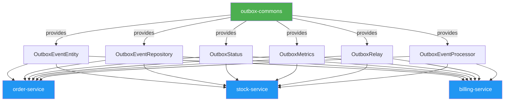

# Outbox Pattern Demo


[](https://openjdk.org/projects/jdk/17/)
[](https://spring.io/projects/spring-boot)
[](LICENSE)

This repository demonstrates the transactional outbox pattern for a pizza-order scenario inspired by the [Habr article on the pattern](https://habr.com/ru/articles/962286/). It showcases how to decouple the write path from side effects while guaranteeing at-least-once delivery between the database and Kafka, and exactly-once business effects through idempotent consumers.

## Architecture

- `order-service` — exposes `POST /api/orders`, validates inventory requests, persists orders together with outbox events in one transaction, and relays unsent events to Kafka.
- `stock-service` — ingests `orders.created.v1`, locks product rows, reserves inventory, and publishes `stock.reserved.v1` through its own outbox so downstream services only proceed after stock is secured.
- `billing-service` — consumes `stock.reserved.v1`, deduplicates via `processed_events`, and captures payments (exposed via `GET /api/payments`).
- `docker-compose.yml` — spins up Kafka (plus UI) and three isolated PostgreSQL databases so each bounded context has its own store.

The important tables mirror the article:

- `orders` and `outbox` live in the order service DB, ensuring atomic writes.
- `processed_events` lives in the billing DB so every consumer controls its own idempotency state.

### Shared Outbox Library

All three services use the **outbox-commons** library, which provides a standardized implementation of the outbox pattern:



This shared library eliminates code duplication and ensures consistent outbox pattern implementation across all microservices.

---

## 📚 Documentation

- **[Using Outbox-Commons](OUTBOX_COMMONS_USAGE.md)** - Complete guide for integrating the outbox library
- **[Troubleshooting Guide](TROUBLESHOOTING.md)** - Common issues and solutions
- **[Deployment Guide](DEPLOYMENT.md)** - Local, Docker, Kubernetes, and cloud deployment
- **[Monitoring & Observability](MONITORING.md)** - Metrics, logging, and distributed tracing
- **[CI/CD Pipeline](CI_CD.md)** - GitHub Actions automated build and deployment
- **[Testing Guide](TESTING.md)** - Integration and test strategies

---

## Getting Started

1. Launch infra: `docker compose up -d`
2. Start services from repo root:
   - `./mvnw -pl order-service spring-boot:run`
   - `./mvnw -pl stock-service spring-boot:run`
   - `./mvnw -pl billing-service spring-boot:run`
3. Create an order (amount in money, quantity in items, SKU must exist in stock DB):
   ```bash
   curl -X POST http://localhost:8080/api/orders \
     -H "Content-Type: application/json" \
     -d '{"customerEmail":"demo@example.com","amount":42.50,"productSku":"PIZZA-MARG","quantity":2}'
   ```
4. Inspect reservations and payments:
   ```bash
   curl http://localhost:8082/api/stock/reservations
   curl http://localhost:8081/api/payments
   ```
   Inventory can be checked via `GET http://localhost:8082/api/stock/products`.

## Postman Collection

Import `postman/outbox-pattern-demo.postman_collection.json` to get ready-to-run requests for creating orders and inspecting stock/payments. Update the collection variables if you host services on different ports.

Kafka UI is available at http://localhost:8085 if you want to watch the topic.

## Testing & Building

- Run unit tests: `./mvnw test`
- Build both services: `./mvnw clean package`

## Next Steps

- Add more consumers (notifications, loyalty) that subscribe to `stock.reserved.v1`.
- Replace the polling relays with Debezium or Kafka Connect for larger loads.
- Introduce retries and alerting for `outbox` rows stuck in `ERROR`, plus compensations for failed reservations.

### The Order Processing Flow

#### Step 1: Order Creation (`order-service`)

1. __HTTP Request__: The process begins when a client sends an HTTP `POST` request to the `order-service` to create a new order.

2. __Transactional Save__: The `OrderService` handles this request. In a single, atomic database transaction, it performs two critical operations:

    - It creates and saves an `OrderEntity` to the `orders` table with a `CREATED` status.
    - It creates and saves an `OutboxEventEntity` to the `outbox_events` table. This outbox event contains the details of the `OrderCreatedEvent` (like order ID, product SKU, quantity, etc.) and has a status of `NEW`.
    - __Why this is important__: By saving the order and the event in the same transaction, the system guarantees that an event is never created without a corresponding order, ensuring data consistency from the very start.

#### Step 2: Event Publishing (`order-service`)

1. __Outbox Polling__: A scheduled background process, the `OutboxRelay`, periodically queries the `outbox_events` table for events with a `NEW` status.

2. __Individual Event Processing__: For each event it finds, the `OutboxRelay` delegates the processing to the `OutboxEventProcessor`.

3. __New Transaction with Retries__: The `OutboxEventProcessor` starts a __new database transaction__ for each individual event. Inside this transaction:

    - It uses a `RetryTemplate` to attempt to publish the `OrderCreatedEvent` to the `orders-created` Kafka topic. This template is configured with an exponential backoff strategy, meaning it will retry several times if it fails, waiting longer between each attempt. This makes the publishing process resilient to temporary network issues with the message broker.
    - If the event is successfully published to Kafka, the status of the `OutboxEventEntity` is updated to `SENT`.
    - If all retry attempts fail, the event's status is marked as `ERROR` for later inspection.
    - __Why this is important__: Processing each event in a separate transaction prevents a single failing event from blocking the entire batch of events.

#### Step 3: Stock Reservation (`stock-service`)

1. __Event Consumption__: The `stock-service` has an `OrderCreatedListener` that is subscribed to the `orders-created` Kafka topic. It receives the `OrderCreatedEvent`.

2. __Idempotent Processing__: The listener passes the event to the `StockReservationService`. The first thing this service does is check if the event has already been processed by looking up the event's unique ID in its `processed_events` table.
    - __Why this is important__: This makes the consumer __idempotent__. Kafka can sometimes deliver a message more than once, and this check ensures that stock is reserved for a given order only once, preventing data corruption.

3. __Transactional Logic__: If the event is new, the service proceeds within a single database transaction:

    - It checks if there is sufficient stock for the requested product.
    - If stock is available, it decrements the product's available quantity.
    - It creates and saves a `StockReservationEntity`.
    - It creates and saves a new `OutboxEventEntity` for the `StockReservedEvent` to its own outbox table.
    - It saves a record of the incoming event's ID to the `processed_events` table to mark it as handled.

#### Step 4: Stock Event Publishing (`stock-service`)

1. __Outbox Polling__: The `stock-service` has its own `OutboxRelay` and `OutboxEventProcessor` that function identically to the ones in the `order-service`.
2. __Publishing `StockReservedEvent`__: This relay publishes the `StockReservedEvent` from its outbox to the `stock-reserved` Kafka topic, again with retries and robust transaction management.

#### Step 5: Payment Capture (`billing-service`)

1. __Event Consumption__: The `billing-service` listens for messages on the `stock-reserved` topic.

2. __Idempotent Payment Processing__: Its `StockReservedListener` passes the event to the `PaymentProcessor`. This processor is also __idempotent__, checking its own `processed_events` table to ensure payment is captured only once per order.

3. __Final Transaction__: If the event is new, the `PaymentProcessor`:

    - Creates and saves a `PaymentEntity` with a `CAPTURED` status.
    - Saves the event's ID to its `processed_events` table.
